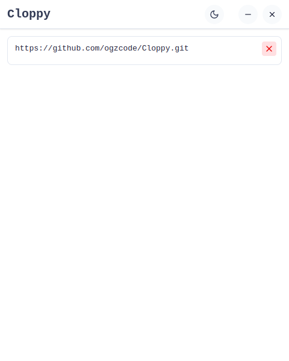
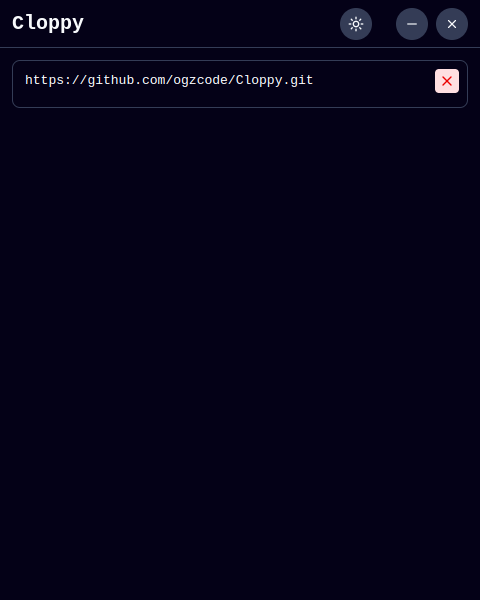

# Coppy
Clipboard application developed using Electron.js for Linux

It stores the contents copied with ctrl+c in a maximum of 20.

## For Use
To use, download the [Cloppy.AppImage.zip](https://github.com/ogzcode/Cloppy/releases/tag/v1.0.0) file in the releases tab. Then assign the keyboard shortcuts to the best shortcut for you.

## For Development
```
git clone https://github.com/ogzcode/Cloppy.git
cd Cloppy
npm i
npm run start
npm run dist
```

#### Light Mode


#### Dark Mode
